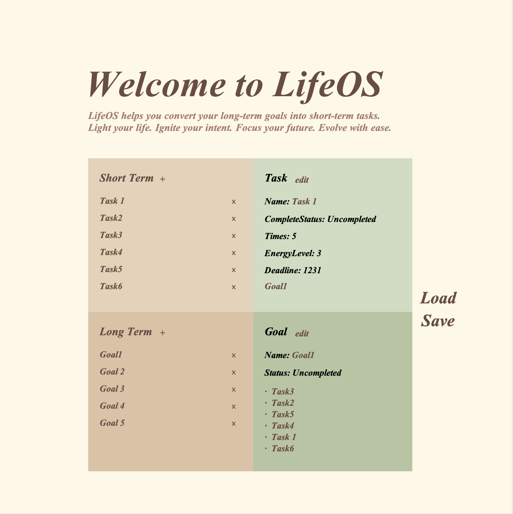

# LifeOS

LifeOS helps you turn long-term goals into actionable steps.

By connecting long-term goals with short-term tasks through a double linking system, LifeOS makes progress feel clear, simple, and achievable.

## Design Philosophy

Less distraction. More intention.

LifeOS uses a low-saturation Morandi color palette and fonts with a handwritten style. The design creates a notebook-like experience where users can record their goals and tasks.

## Get Started

Run LifeOS directly:

- macOS/Linux: `./run.sh`
- Windows: Double-click `run.bat`

To create a desktop app:

- macOS: `./package-macos.sh`
- Windows: `package-windows.bat`

## Usage

1. Your progress is saved when you click **Save** or exit.
2. Click **Load** to restore your latest saved progress.
